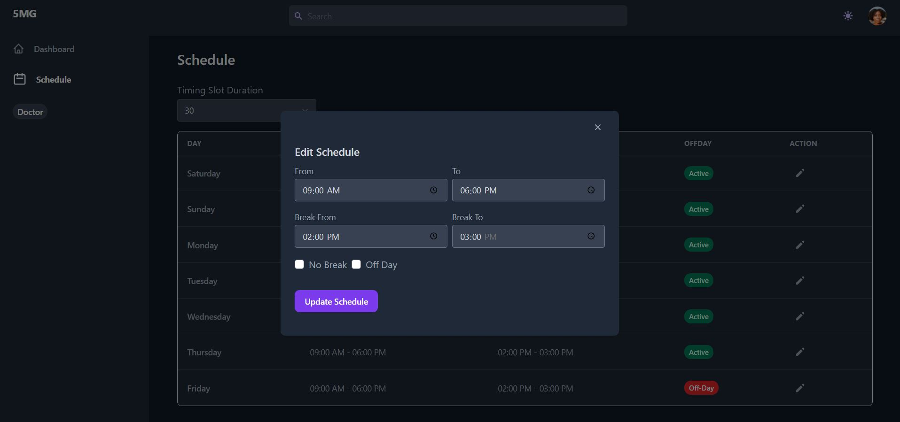
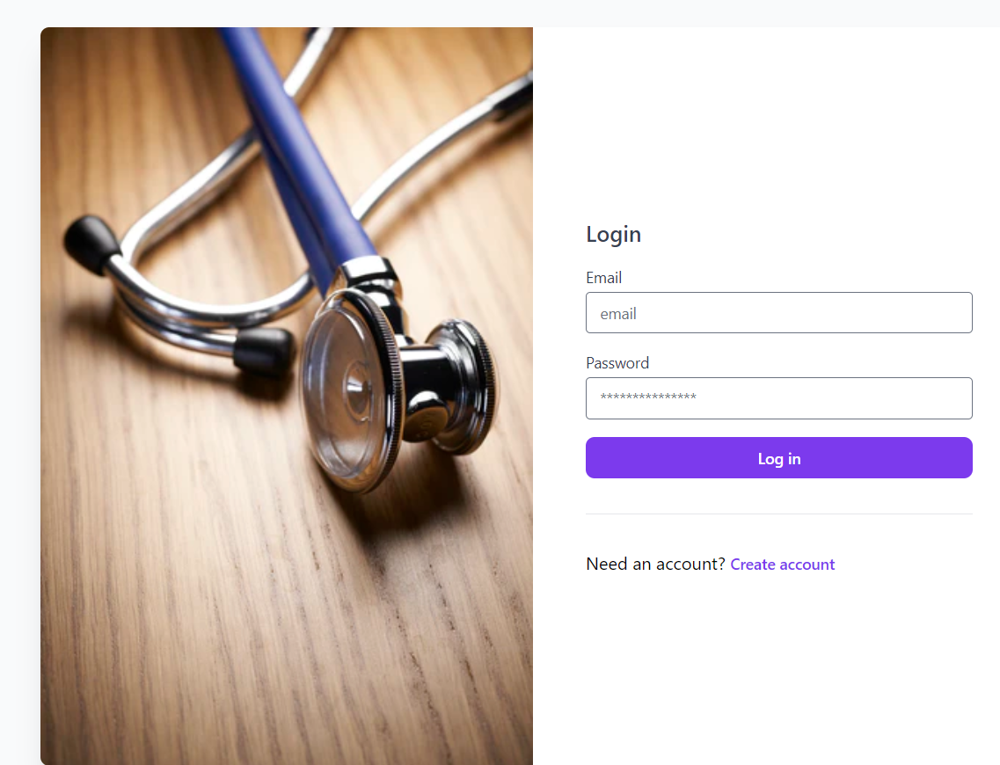

# Doctor Appointment System

<p align="center">
   
</p>


### Description
- By using this system people can easily get to know about the timing of the doctor's counselling period and make their meeting whenever they want.
- This will help common people to get instant support without wasting time and effort even if they will get this service from home and abroad.

- Challenges - 
   - We have faced some challenges in creating schedule timing for the doctors because the doctors do not see the patients at the same time every day.
   So, we make sure that the patient gets the appointment without breaking the doctors schedule.

### Technologies 

- Backend 
    - [Laravel Framework](https://laravel.com) - (RESTful API)

- Frontend  
    - [TailwindCSS](https://tailwindcss.com)
    - [Vue.js](https://vuejs.org)

- Database
    - MySQL - ( use [XAMPP](https://www.apachefriends.org/index.html) )
     

### Getting Started


- Clone this project using the following commands:

    ```
    git clone https://github.com/arfanchowdhury/doctor_appointment_system.git
    cd doctor_appointment_system
    ```
- Setup Guideline For Backend
    
    ```
    cd server
    ```
    - Copy .env.example file to .env and edit database credentials there
    - Put the database details in the .env file:

    ```
    DB_CONNECTION=mysql
    DB_DATABASE=
    DB_USERNAME=
    DB_PASSWORD=  
    ```
    - Install the project dependencies, generate a project key, run the migrations and then start the server:

    ```
    composer install
    php artisan key:generate
    php artisan migrate
    
    ```

    ``` 
    php artisan passport:install

    ```
    - Output

    ```
    # this command generates the encryption keys, personal access client, and password
    # grant client which we'll use to generate the access tokens
    Encryption keys generated successfully.
    Personal access client created successfully.
    Client ID: 1
    # your client id 1 will be different from the output below
    Client secret: KTIqQ7nwiIoJf9uxxxxxxxxxxxxxxxxxxxxxxxx
    Password grant client created successfully.
    Client ID: 2
    # your client id 2 will be different from the output below
    Client secret: 43x92qhcW4Itxxxxxxxxxxxxxxxxxxxxxxxxx
    ```
    - *Note : remember this client secret id ( you can use client secret id 1 or 2 ) for client site configuration

    - Serve your backend application by running the following command:

    ``` 
    php artisan serve
    ```

- Setup Guideline For Frontend 

    ```
    cd client
    npm install
    ```
    - configuration your client secret id 1 otherwise 2
    - goto folder src/config/Store.js set client_id and client_secret 
      
        - *Note: Use previously created client IDs and client secrets
        ```
        client_id: 1,
        client_secret: "KTIqQ7nwiIoJf9uxxxxxxxxxxxxxxxxxxxxxxxx",

        or

        client_id: 2,
        client_secret: "43x92qhcW4Itxxxxxxxxxxxxxxxxxxxxxxxxx",
       ```

    - Serve your backend application by running the following command:

        ```
        npm run dev
        ```
                   

### Project Demo Video 
<p align="center">
    <a href="https://drive.google.com/file/d/1oqmoMuxD60rtl1kx0kN6KteszpV6pHJT/view?usp=sharing
    " target="_blank">
        
    </a>
</p>

